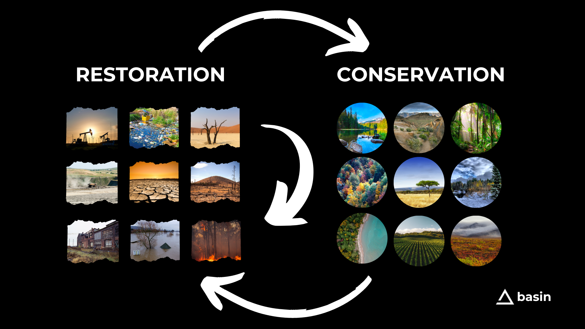

# Restoration & Conservation

### Ecosystems, Carbon Sinks, Properties & Buildings

How big is the opportunity?&#x20;

The market is significant: \~75% of land on earth is "degraded". (IPBES)

That is a huge market but Basin is designed to maximize climate, nature and carbon impact and the edges are where the most leverage is.

<figure><figcaption>
 
</figcaption></figure>

<mark style="color:red;">**Left**</mark>**:** the most contaminated, polluted, run down.

<mark style="color:yellow;">Middle</mark>: degraded.

<mark style="color:green;">**Right**</mark>**:** the most pristine, beautiful, threatened.

The Basin model works for any property, any ecosystem and the middle is wide open for anyone to build on on top of.  However, the core team is focused on the **Edges and Ecotones** which have the most potential impact and business case**.**

## Restoration ➡️ Conservation

When we set out on this journey the original goal was to _conserve and protect_ ecosystems.  We quickly learned two things:

1. That there are whole fields of study called _conservation finance_ and _conservation development_ and while good intentioned, are struggling.  Absent of large philanthropic or government money, they are struggling to make the numbers work.  The deals are simply not investable.
2. That the world's lands are in much dire shape than we thought:  less than 25% of the Earth’s land has escaped substantial impacts of human activity with the area expected to be less than 10% by 2050.  This make conservation even more important and presented another opportunity: restoration.

What if we could build a business around restoration, then use those skills, techniques and projected profits to fund and fuel conservation?&#x20;

The idea of and the energy around a Constitution DAO or Redemption DAO style rally crowdfunding is great.  There is something in this model for sure but it always comes back to:  a) why would people commit funds and b) if successful, what happens after we get the thing.

### A Business Model

What was needed is a business model to harness and focus this excitement and enthusiasm: a way for people to make money restoring, regenerating and conserving the earth's ecosystems.

Basin is this business model.  Basin provides and connects all the tools needed to do real estate based climate, nature and carbon projects with a focus on restoration and conservation.

We use restoration to fund conservation.  And do this in a way that can deploy, repeat and scale in perpetuity.

<figure><figcaption></figcaption></figure>

