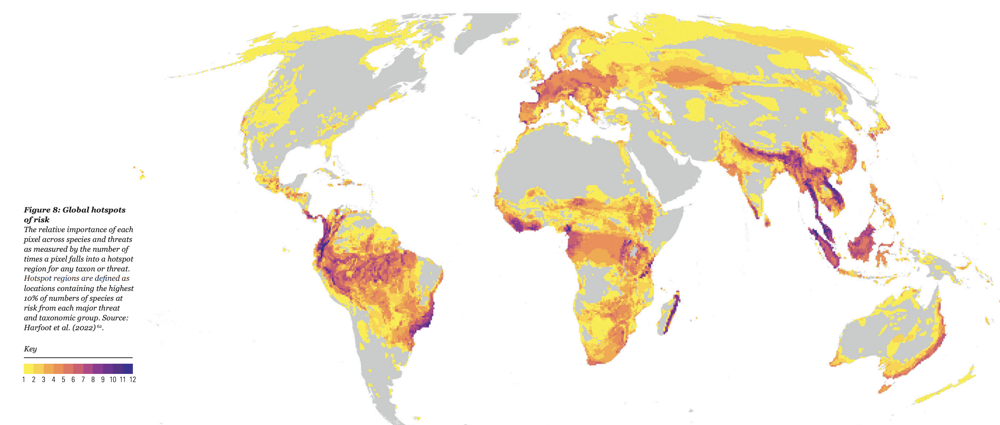

# Living Planet Index

The Living Planet Index (LPI) is a measure of the state of the world's biological diversity based on population trends of vertebrate species from terrestrial, freshwater and marine habitats.  The [LPI](https://livingplanetindex.org/) was adopted by the Convention of Biological Diversity (CBD) as an indicator of progress towards its 2011-2020 targets and will play an important role in monitoring progress towards the post-2020 goals and targets from COP15 (2022).

<figure><figcaption></figcaption></figure>

<figure><figcaption>
WWF LIVING PLANET REPORT 2022
</figcaption></figure>

<figure><figcaption>
The Biodiversity Intactness Index 2022
</figcaption></figure>

## Use in $BASIN

We use the Living Planet Index to create and manage the [$BASIN tokenomics](./) to incentivize certain types of climate projects.
