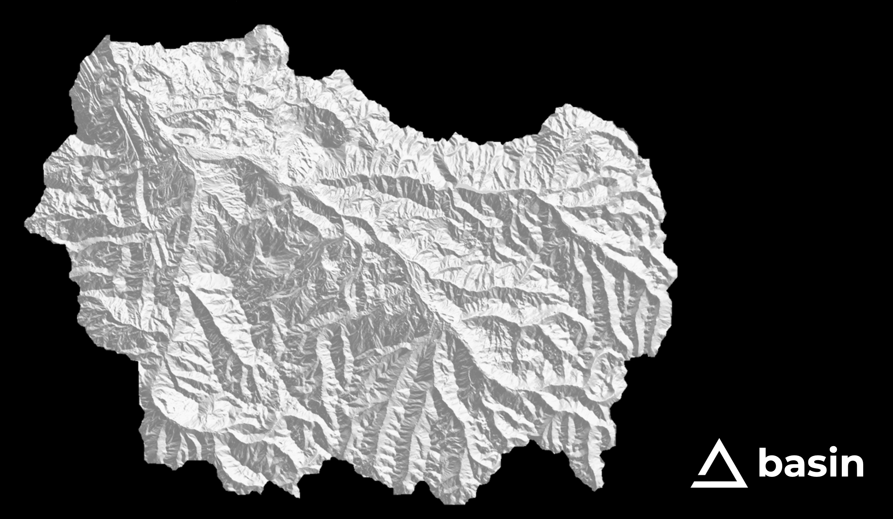

# Basin's

## Watersheds, Bioregions & Ecoregions

Basin is organized according to basins, or watersheds.  These watersheds align closely with the same nature made bioregions that humans have been organizing around for thousands of years.

This organizational structure allows for:

* Regional climate resilience
* Local knowledge
* Cultural preservation and inclusion
* Stakeholder project governance
* Asset sourcing
* Regenerative economies
* Bioregional natural capital assets
* Bioregional Credit Unions

As with anything in nature, basin's do not align perfectly with ecosystems, bioregions or ecoregions but they are very close.  Basin's are well studied and mapped and less subjective than bioregions.  Basin's are easy to explain and give all of us a sense of place.  We are currently using the [Hydrosheds](https://www.hydrosheds.org/) for basin delineation.

A bioregional approach allows for resource sharing across bioregions to promote restoration and conservation activities that flow across and through multiple bioregions.  The Basin Protocol will score each Basin to direct flow of value.

## $BASIN

The term $BASIN refers to the above organizational design.  A $BASIN can be a [Tributary](tributaries.md) or a [Confluence](confluences.md).  All people, organizations, Basins in Basin each have their own $BASIN.  All $BASINS are unique.  See [..](../ "mention")

<figure><figcaption>
The Roaring Fork and Crystal Watersheds - HydroSheds Level 6
</figcaption></figure>
